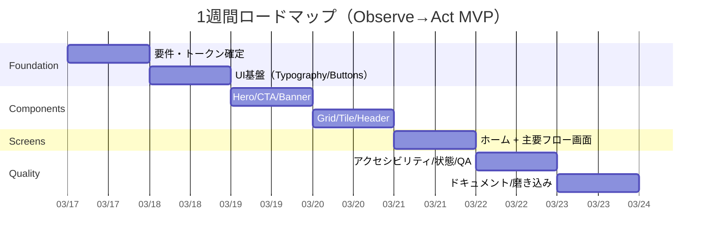

# 観察して操作するためのパーソナルUIデザインシステム研究レポート

## エグゼクティブサマリー

本レポートは、あなたが共有した6アプリ（SMBC Olive、d NEOBANK、ANAマイレージクラブ、povo2.0、JR東日本公式アプリ、SwitchBot）のスクリーンショット分析と、あなたの発言（「直感的」「頻度高いのに嫌いにならない」「操作が理想だが状態を見るのも大事」「UIが柔らかい」など）を統合し、**個人開発アプリに転用できる“個人用デザインシステム”**として定義するものです（プラットフォーム/技術スタックは特に制約なし前提）。

結論として、あなたの嗜好はかなり明確で、核は **Observe → Act（状態を見て、すぐ操作）** です。これは以下の要素で一貫しています。

- **Big Metric（大きな数値/状態）**：残高・データ容量・マイル・所要時間など、最重要指標をファーストビューの中央に大きく置く  
- **Action-first（1タップ導線）**：ホームから「目的の操作」を最短で実行できる（経路検索GO、振込、トッピング追加、家電オン/オフなど）
- **Soft Functional（柔らかい実用UI）**：実用性を損なわず、圧を下げる（マスコット、丸み、淡いトーン、過度なグラデーションは避ける）
- **ミニマル配色 + 高い統一感**：色数は少なく、面の階層とタイポグラフィで情報の優先度を作る
- **“使わない機能”を目に入れない設計**：機能過多（Feature bloat）を嫌う傾向があり、パーソナライズ/非表示/並べ替えが効く設計が相性が良い

この方針に沿って、後半では **色（hex提案）・タイポ/余白/角丸・コンポーネント仕様（8–12個）・1週間の実装ロードマップ**まで落とし込みます。アクセシビリティは、最小タップ領域（iOS 44×44pt、Android 48×48dp）やターゲットサイズ（WCAG 2.2の最小基準）を満たすよう規定します。

---

## スクショ別UI分解

以下は、各スクショから読み取れる **UI構造 / ビジュアルトークン / コンポーネント棚卸し / インタラクション / アクセシビリティ観点** を、個人開発へ転用しやすい形で整理したものです（数値はスクショの見た目から推定、個人情報は意図的に記載しません）。

### SMBC Olive（ホーム）

**UI構造（情報ダッシュボード + カードスタック + 中央CTA）**  
- ブランド色の全面背景 → 白いカード群で内容を浮かせる
- 上から「主要指標（残高）」「支払いモード/利用額」「ポイント」「特典/状況」と、**重要度順にカードが積層**
- 画面下部に **ボトムナビ + 中央の強いCTA（送金・振替系）** を配置（行動の入口を固定）

**ビジュアルトークン（スクショ抽出の代表色）**  
- Brand Background：深緑系 **#1C4733**  
- Surface（カード）：**#FFFFFF**  
- Sub-surface：**#EEEEED**  
- サポート色（中間の緑/落ち着いたニュートラル）：**#517165**, **#AFB3A6**  
→ 「白カード × 濃色背景」で、金融の信頼感と視認性を両立しやすい。

**コンポーネント棚卸し**  
- Heroではなく **Primary Card（残高カード）** が最上段  
- 情報カード（タイトル/補足/大数値/右矢印）  
- 値非表示トグル（プライバシー）  
- ポイント行（ロゴ+右矢印）  
- 2カラムの小型カード（状況/特典）

**インタラクションパターン**  
- 1タップで詳細へ：カード全体がタップターゲット  
- 「非表示」で数値を隠す：公共空間での覗き見対策（金融アプリの定番）

**アクセシビリティ観点**  
- 大数値は読みやすいが、右上アイコン（通知/ヘルプ）が小さくなりがち → **最小タップ領域**を満たす余白が必要（iOS 44×44pt目安）。  
- 濃色背景上の小さな文字はコントラストに注意（特にサブ情報）

**オンライン情報（公式/ストア）補足**  
三井住友銀行アプリは口座開設や残高・明細確認、振込・送金等を提供し、Oliveアカウント申込にも対応すると説明されています。  
App Storeでは評価4.6・評価件数110万件が表示されています。  
Google Playでは評価3.0前後・約5万件レビューの表示で、レビューには「My通帳」関連の不具合・同期や設定リセットなどの不満も見られます。  
またSMBCグループ側は、デザインシステム構築などを含むデザインチームの取り組みを発信しています。  

---

### d NEOBANK（住信SBIネット銀行系、ホーム）

**UI構造（Hero Metric + 4×2の機能グリッド + 通知バナー）**  
- 上部のブルーグラデーション領域が **Hero（残高）**  
- その下に **主要機能のショートカット（ATM/明細/振込/照会…）** が格子状に並ぶ  
- 重要通知がバナーで差し込まれる（リブランド/告知など）

**ビジュアルトークン（スクショ抽出の代表色）**  
- Hero Gradient（代表点）：**#1264BE**, **#1B8DC3**  
- Surface：**#FFFFFF**  
- Light Surface：**#EBF1F9**  
→ ヒーローで“状態”、グリッドで“操作”を分離する設計。

**コンポーネント棚卸し**  
- Hero Metric（残高 + 目アイコンで表示切替）  
- セグメント/ドロップダウン（口座切替）  
- 4列アイコングリッド（円形背景 + アイコン + ラベル）  
- 通知バナー（矢印付き）  
- ボトムナビ

**インタラクションパターン**  
- ホームから主要操作へ1タップ（あなたが高評価した点）  
- 「もっとみる」で追加機能を段階開示（Feature bloat対策として有効）

**アクセシビリティ観点**  
- アイコン＋ラベルは理解しやすいが、ラベルが短い語に依存しやすい → VoiceOver/TalkBack用の補足ラベル推奨  
- グラデーション領域上の文字は、端末の明るさ/屋外でコントラスト低下しやすいので「高コントラストモード」前提で色決めを推奨

**オンライン情報（公式/ストア）補足**  
住信SBIネット銀行は2025年にホーム画面のデザインリニューアル（視認性向上等）を案内しています。  
また「d NEOBANK」へのブランド転換（NTTドコモグループ参画に伴う名称変更）も公式ページ/リリースで説明されています。  
App Storeでは評価4.6・評価件数41万件が表示され、レビューには「わかりやすいUI」やATM/手数料面の利便性評価が見られます。  
一方Google Playでは評価3.5・約5.6万件レビューの表示で、認証/遷移で詰まるレビューも見られます。  
住信SBIネット銀行側は「カード型UI」採用などUI変遷も公開しています。  

---

### ANAマイレージクラブ（ホーム）

**UI構造（Wallet Card + サービスグリッド + Discoveryフィード）**  
- 中央に **会員カード風の大きなカード**（マイル/ポイント）  
- その下に航空券/ホテル/モール等の **サービスアイコングリッド**  
- さらに「おすすめスポット」など **コンテンツフィード + フィルタチップ**  
- ボトムナビ中央に **Pay（決済）** が強調され、生活圏への拡張意図が見える

あなたの評価（統一感・高級感・作り込みの割に見やすい）と整合します。

**ビジュアルトークン（スクショ抽出の代表色）**  
- Background：**#F2F3F4**, **#FAFAFA**  
- Navy：**#262841**（文字/ブランドの芯）  
- Blue-gray：**#5F7497**, **#89ABD3**（落ち着いた航空系トーン）  
- Gold系：**#C1A47A**（プレミアム感の補助）  
→ “高級感”は、彩度ではなく「低彩度 + 濃紺 + 微量の金」で作っている。

**コンポーネント棚卸し**  
- Wallet Card（横長、カードらしい罫線/質感）  
- サービスグリッド（アイコン+ラベル）  
- Filter Chips（横スクロール）  
- コンテンツカード（画像タイル）  
- 中央突出のPayボタン（ボトムナビ組み込み）

**インタラクションパターン**  
- 「カード→詳細」と「Pay→即決済」が二大導線  
- Discover（スポット/For You）領域は“頻度が低いなら許容”というあなたの発言とも一致

**アクセシビリティ観点**  
- 薄いグレー背景×淡い文字は、屋外や小サイズでコントラストが落ちやすい  
- チップは小さくなりがちなので、タップ領域は44×44pt相当を確保し、チップ自体が小さくても余白で担保する設計が有効。  

**オンライン情報（公式/ストア）補足**  
ANAの公式案内では、マイル残高確認や、スポット/ANA Payなどを含む「貯める/使う」機能を説明しています。  
App Storeでは評価4.6・評価件数7万件が表示されています。  
Google Playでは評価3.9・約6千件レビューの表示で、ログイン/認証周りや一部機能の不具合に関する不満が見られます。  
外部記事では「スーパーアプリ構想」文脈でのアプリ刷新が語られています。  
ANA Payについては、UI上の財布切り替えなど“使い勝手”に触れる報道もあります。  

---

### povo2.0（ホーム）

**UI構造（Usage Dashboard + Promotion Feed + 購入導線）**  
- セグメント（国内/海外）  
- 中央に **大きなデータ残量（円形の器）**＝Observe  
- その下にSMS/通話などの副指標  
- 以降は「イチオシ情報」など、購入/キャンペーン導線（多色のバナー）

あなたの評価は「ポップだが直感的」「広告も実用性がある」「頻度が低いので気にならない」「Friendly寄りで好き」。

**ビジュアルトークン（スクショ抽出の代表色）**  
- Base background：**#F4F4F8**  
- UIの芯になる濃色：**#446085**  
- 効かせ色（警告/CTA寄り）：**#DFA14E**  
- バナー由来で多色になりやすい（ここはあなたが許容している領域）

**コンポーネント棚卸し**  
- Metric Circle（巨大数値＋単位）  
- Mascot/キャラクター（Friendly Brand）  
- セグメントコントロール（国内/海外）  
- CTAピル（「詳細な内訳」）  
- プロモーションカード（横スクロール）

**インタラクションパターン**  
- “残量を見る→必要ならトッピング”が基本フロー（Observe→Actの典型）  
- 販促を上手く“邪魔”から“選択肢”へ寄せているのが強み（あなたの評価と一致）

**アクセシビリティ観点**  
- バナーに文字情報が画像で載ると、読み上げ/拡大で弱くなる → 重要情報はテキストでも提供  
- 円形メトリックは視認性が高いが、色だけで残量を表すと色覚多様性への配慮が弱い → 数値/ラベル併用が必須（このUIは数値中心で良い）

**オンライン情報（公式/ストア）補足**  
povo2.0は基本料0円・必要な分だけ「トッピング」追加という説明がApp Store/Google Playに記載されています。  
App Storeでは評価4.8・評価件数4.9万件が表示され、レビューには「手続きがスムーズ」「プランが分かりやすい」などの記述も見られます。  
一方、App Storeのレビュー単体ページには「ボタンが溶け込んで迷う」等、導線の分かりにくさを指摘する声もあります。  
Google Playでは評価4.3・約1.3万件レビューが表示され、最終更新日も掲載されています。  
公式FAQではサポート対象OSの情報が更新され、サポート終了方針も案内されています。  
公式リリースとしてauかんたん決済対応なども告知されています。  

---

### JR東日本公式アプリ（経路検索・結果・詳細）

**UI構造（Single Core Taskを極めた Task UI）**  
あなたが「最高」「頻度高いのに嫌いにならない」と評した理由は、スクショ3枚で説明できます。

- 検索画面：出発/到着 + 巨大CTA **GO!**（迷いが発生しない）  
- 結果一覧：複数ルートが縦に時間軸で並び、比較が即時  
- 詳細：運賃/距離/注意情報を“必要十分”にまとめ、保存/共有/IC残高確認など次の行動へ繋ぐ

**ビジュアルトークン（スクショ抽出の代表色）**  
- 検索画面のフレーム（ヘッダー/フッター）：**#355260**  
- CTAグリーン：**#5E9679**（検索ボタン）  
- ダークモード背景：**#0E1B24** 近傍  
- ダーク上のアクセント：**#79A58A**  
→ “落ち着き”と“即時性”が両立する配色（過剰な装飾なし）。

**コンポーネント棚卸し**  
- Primary CTA（丸いGO）  
- 検索タブ（履歴/検索/よく見る）  
- ルートカード（タイムライン型）  
- フィルタタブ（早/楽/安）  
- 警告バッジ（工事/遅延など）  
- 詳細のセクションカード（お知らせ、運賃内訳、周辺施設チップ）  
- 共有ボタン、保存系ショートカット

**インタラクションパターン**  
- 1回の意図入力（出発/到着）→ 候補提示 → 選択 → 共有/保存  
- ルート候補が視覚比較でき、**“探すストレス”が少ない**（あなたの嗜好の中心）  
- 「よく見る検索」登録など、頻度が高い作業の“省力化”が組み込まれている

**アクセシビリティ観点**  
- ダークUIは眩しさの低減には有効ですが、色付きバッジや小さな文字が密集すると読みにくい → 重要情報は文字サイズ/行間で担保  
- ルート比較は色だけで判断させない（このUIは時間・分・バッジの多重表現で比較可能）

**オンライン情報（公式/ストア）補足**  
JR東日本アプリの公式サイトは、経路検索・運行情報・列車走行位置・駅情報等を主要機能として説明しています。  
App Storeでは評価4.5・評価件数9.2万件が表示され、ストア説明内でも「斬新なUI」「視覚的に並ぶ検索結果」等の言及があります。  
Google Playでは評価3.9・約2.9万件レビューが表示され、レビューには「便利だが混雑状況がたまに違う」等の指摘も見られます。  
外部記事でも、乗換案内の“縦型で直感的な表示”が話題になったことが報じられています。  

---

### SwitchBot（ホーム）

**UI構造（Control Dashboard：ホーム＝操作盤）**  
あなたの評価「ホームから色々操作できてめちゃくちゃいい」の通り、これは **Command Center UI**の完成形に近い。

- 上部：温湿度など **環境メトリック（Observe）**  
- 中段：「よく使うシーン」＝定型操作（Act）  
- 下段：部屋ごとのデバイスカード（個別操作）

**ビジュアルトークン（スクショ抽出の代表色）**  
- Background：**#E5E5E5**, **#DDDDDD**（ニュートラルで情報の邪魔にならない）  
- Surface：**#FFFFFF**  
- Text：**#4B4D55**  
→ 色で魅せず、**レイアウトとカードで“操作性”を作る**タイプ。

**コンポーネント棚卸し**  
- セクション見出し（部屋/カテゴリ）  
- デバイスカード（アイコン/名称/状態/ワンタップ操作）  
- シーンカード（実行ボタン）  
- 状態チップ（温度/湿度など）  
- 追加（＋）ボタン  
- ボトムナビ（ホーム/オートメーション/ストア/プロフィール）

**インタラクションパターン**  
- 1タップでON/OFF、詳細はカードタップで深掘り  
- “ホームで完結”を優先し、遷移コストが低い（Zero Navigationに近い）

**アクセシビリティ観点**  
- デバイス名が短いと理解しやすいが、同種デバイスが増えると区別が難しい → アイコン/サブラベル/部屋名で冗長化推奨  
- 状態（オン/オフ）を色だけで表さず、文言（オン/オフ）も併記しているのは良い

**オンライン情報（公式/ストア）補足**  
App StoreではSwitchBotがスイッチ操作・温湿度の遠隔観測・家電の一括管理等を説明し、評価2.8・評価件数6294件が表示されています。  
Google Playでも評価2.8・約6千件レビューが表示され、レビューにはネットワークエラーやオートメーション機能などの改善要望が見られます。  
公式サポート記事では、セットアップ時の位置情報権限など、動作要件に触れています。  
外部比較では「操作が直感的で迷いにくい」といったUI面の評価もあります（競合比較）。  
一方で、アップデート後の不具合やUI変更の不満を取り上げる記事もあり、信頼性/UI変更の管理が課題になり得ます。  

---

## 横断比較と示唆

### 比較テーブル

| App | UIタイプ | Primary Metric（最重要指標） | Primary Action（主操作） | ナビパターン | ビジュアルトーン | 再利用しやすい要素 |
|---|---|---|---|---|---|---|
| SMBC Olive | 情報ダッシュボード（カード積層） | 残高 | 振込/振替（中央CTA） | 下部タブ + 中央強CTA | 信頼・硬め（濃緑×白） | 白カード、値非表示、中央CTA |
| d NEOBANK | Hero Metric + 機能ランチャー | 残高 | ATM/振込（グリッド） | 下部タブ | 実用・爽やか（青グラデ） | Hero、4列グリッド、段階開示 |
| ANAマイレージ | Wallet + サービス + Discover | マイル/ポイント | Pay/予約/特典 | 下部タブ + 中央Pay | 高級・統一（低彩度×濃紺） | Walletカード、チップ、中央Pay |
| povo2.0 | Usage Dashboard + 販促 | データ残量 | 内訳→トッピング | 下部タブ | ポップ・柔らか（マスコット） | 円形メトリック、マスコット、販促の整理 |
| JR東日本 | Task UI（経路検索特化） | 所要時間/到着時刻/ルート | GO→ルート選択 | 下部タブ + フィルタ | 落ち着き（深紺/ダーク+緑） | 巨大CTA、縦比較、保存/共有 |
| SwitchBot | Control Dashboard（操作盤） | 室温/湿度/状態 | シーン実行・ON/OFF | 下部タブ | ニュートラル（グレイ×白） | デバイスカード、部屋セクション、状態+操作同居 |

### 示唆

あなたが強く反応したのは、**JR東日本 × SwitchBot** に共通する「迷わない」「ホームで完結」「状態→操作」の設計です。つまり、あなたの個人開発のホームは **“情報一覧”ではなく“コントロールセンター”** として設計すると再現性が高いです。

また、あなたが気にしていた「不要機能が多い」「どれを触ればいいか迷う」は、d NEOBANKや大型アプリが抱える典型課題です。解決策は、**段階開示（More） + パーソナライズ（非表示/並べ替え） + 主要導線の固定**です（後述のデザインシステム規約に織り込みます）。

---

## パーソナルデザインシステム提案

ここからは、あなたの嗜好（Observe→Act / Soft Functional Dashboard / Big Metric / ミニマル配色 / Friendly要素）を、**そのまま実装できる規約**として提示します。

### カラーパレット（hex提案）

前提：色数は最小。**ニュートラル + ブランド1色 + セマンティック最小限**。  
（以下は「推奨プリセットA」。B/Cは派生として付けます）

**プリセットA：Deep Teal（JR/SMBC寄り、落ち着き+行動）**  
- `bg`：#F5F6F8（薄いグレー）  
- `surface`：#FFFFFF  
- `surface_alt`：#EEF1F4  
- `text`：#0F172A  
- `text_muted`：#475569  
- `border`：#E2E8F0  
- `primary`：#2F7D67（CTA/選択状態）  
- `primary_dark`：#1C4733（濃背景/ヘッダー）  
- `warning`：#F59E0B（注意）  
- `danger`：#E11D48（エラー）

**プリセットB：Premium Navy（ANA寄り：高級/統一感）**  
- `primary`：#262841  
- `primary_soft`：#5F7497  
- `accent_gold`（必要時のみ）：#C1A47A

**プリセットC：Fintech Blue（NEOBANK寄り：爽やか/信用）**  
- `primary`：#1264BE  
- `primary_soft`：#1B8DC3

> あなたが「グラデは嫌いだが抑えめならあり」なので、グラデは**Hero背景にのみ、低コントラストで限定**します（例：`primary`→`primary_soft`の2点のみ、彩度を上げない）。

### タイポグラフィスケール

原則：**数値は大きく、ラベルは小さく。**（Big Metricの徹底）  
- Display（メトリック）：32–40（Bold / Tabular Figures推奨）  
- Title：20–24（Semibold）  
- Body：16（Regular）  
- Caption：12–13（Regular）  
- Unit（円/GB/マイル）：12–14（Medium、数値の右に寄せる）

iOSではDynamic Typeにより文字サイズ調整が可能であるため、**テキストスタイル（Semantic）で指定**し、固定pxを避けるのが安全です。

### スペーシングシステム

- 基本グリッド：4pt  
- 余白トークン：4 / 8 / 12 / 16 / 24 / 32 / 40  
- セクション間：24–32  
- カード内：16（標準）、Heroは20–24

あなたが「見やすい」を評価したアプリ群は、共通して **“カード内余白が厚い”**（SwitchBot/JR/SMBC）ため、16を最小単位にすると再現しやすいです。

### 角丸（Radius）とカード規約

- `radius_s`：12（チップ/小ボタン）  
- `radius_m`：16（標準カード）  
- `radius_l`：20–24（Hero、重要カード）

カード規約：  
- 影は基本OFF（金融/インフラ系の“堅さ”を保つ）  
- 代わりに境界線（`border`）か、背景差分（`surface_alt`）で階層を作る  
- タップ領域はカード全面（行単位）＝SwitchBot/JRの快適さを踏襲

### ボタン/アイコン規約

**タップターゲット**  
- iOS：目安 44×44pt   
- Android：目安 48×48dp   
- Webの最低基準：24×24 CSS px（例外あり）   

**ボタン**  
- Primary：高さ 52–56、角丸 16–24、塗り（`primary`）  
- Secondary：同サイズ、アウトライン（`primary`枠）  
- Tertiary：テキストボタン（リンク用途）、ただし“溶け込む”問題（povoのレビュー指摘）を避けるため、**最低限の背景/下線/アイコン**を付けるのが安全です。  

**アイコン**  
- 24×24を基本、線幅は2px相当で統一  
- 状態表現は「色だけ」に依存せず、ラベル（オン/オフ、注意）を併記（SwitchBot/JR方式）

### インタラクションルール（あなたの嗜好を規約化）

- ホームは **Observe→Act** の順序を壊さない  
  - 上：状態（1–3個まで）  
  - 中：主要操作（2–8個、グリッド/行）  
  - 下：履歴/詳細/おすすめ（頻度が低いもの）
- Primary Actionは常に見える場所に固定（JRのGO、SMBCの中央CTA）  
- 機能過多対策：  
  - **More（段階開示）**  
  - **非表示/並べ替え（パーソナライズ）**  
  - “あなたに不要”を減らす（d NEOBANKであなたが感じた課題の解決）

---

## 再利用コンポーネント仕様

以下は、あなたのデザインシステムとして「最少8・最大12」で揃えると強い、実装前提のコンポーネントセットです（推奨は10個）。プロップはReact/Flutter等どれでも移植できる抽象定義にしています。

| コンポーネント | 役割 | 構造（Anatomy） | 主要トークン | 主要バリアント | 例 props（抜粋）/実装メモ |
|---|---|---|---|---|---|
| HeroMetricCard | 最重要状態を1枚で見せる | title / value / unit / subtext / visibilityToggle | radius_l, padding 20–24 | `plain` / `subtleGradient` / `dark` | `{title, value, unit, isHidden, onToggleHidden}`：数値はTabular Figures推奨 |
| PrimaryCTAButton | 1アクションで完了の入口 | label / icon(optional) | height 56, radius 20–24 | `filled` / `filledDark` | `{label, icon, loading, disabled, onTap}`：常に44×44pt以上 |
| QuickActionGrid | 1タップ操作群（NEOBANK/SwitchBot） | items（icon,label,badge） | cell min 72–88 | `4col` / `2col` / `scroll` | `{items, columns=4}`：“More”を最後に固定し段階開示 |
| ActionTileCard | 個別操作（SwitchBotデバイス） | icon / name / state / action | radius_m, padding 16 | `toggle` / `navigate` | `{name, stateText, leadingIcon, onPrimary, onOpen}`：状態は色+テキスト併記 |
| RouteOptionCard | JRのルート比較カード | depart/arrive/duration/badges | compact padding 12–16 | `default` / `warning` | “比較”が目的なので、同一レイアウト固定（情報密度を揃える） |
| FilterChipBar | 絞り込み（ANA/JR） | chips（label,count） | radius_s, height 32–36 | `scroll` / `wrap` | `{chips, selectedId, onSelect}`：小さくてもタップ領域確保 |
| NoticeBanner | 重要通知（NEOBANK/JR） | icon / message / chevron / dismiss(optional) | padding 12–16 | `info` / `warning` / `danger` | `{tone, message, onTap, dismissible}`：色だけに依存せずアイコンも変える |
| SectionHeader | セクション区切り | title / actionLink(optional) | spacing 12–16 | `withAction` | `{title, actionLabel, onAction}`：povoの「もっと見る」型 |
| BottomNavigation | 低頻度遷移の固定 | items / activeId | height 56–64 | `4items` / `5items+center` | “中心機能”があるなら中央強調（SMBC/ANA方式） |
| FriendlyEmptyState | 柔らかさ（povo） | illustration/mascot + title + CTA | radius_m | `mascot` / `none` | `{illustration, title, description, primaryAction}`：頻度低画面に効く |

---

## 実装ロードマップ

目的：**MVPとして「Observe→Actホーム」と「主要1フロー（JRのGO相当）」を1週間で形にする。**  
（目安：合計 30〜40時間）

### 優先順位（MVP）

- 最優先：Design Tokens（色/余白/タイポ）＋ HeroMetricCard ＋ PrimaryCTA ＋ QuickActionGrid  
- 次点：NoticeBanner、ActionTileCard、BottomNavigation  
- 後回し：Discoverフィード、ショップ/コンテンツ面（あなたの嗜好上、MVPの価値が出にくい）

### 1週間のマイルストーン（例：合計 36h）

- Day1（5h）：要件整理（あなたのアプリの“主要タスク1つ”定義）＋トークン確定（プリセットA/B/C）  
- Day2（6h）：コンポーネント基盤（Typography/Spacing/Buttons）実装＋Story/Preview環境  
- Day3（6h）：HeroMetricCard、PrimaryCTAButton、NoticeBanner  
- Day4（6h）：QuickActionGrid、ActionTileCard、SectionHeader  
- Day5（5h）：ホーム画面テンプレ（Observe→Act）＋主要フロー画面（結果一覧/詳細のどちらか）  
- Day6（5h）：アクセシビリティ（タップ領域、読み上げラベル、Dynamic Type）＋状態管理（Loading/Error）  
- Day7（3h）：ドキュメント化（コンポーネント仕様、設計意図、利用例）＋リファクタ

タップ領域の基準（iOS 44pt、Android 48dp）をQAチェック項目に入れるのを強く推奨します。  

---

## オンライン調査まとめと参照ソース

このセクションは「公式情報」「ストア評価/レビュー」「第三者のデザイン言及」をアプリ別に短くまとめ、あなたが後で参照しやすいようにしました。ストア評価は時点で変動し得ます（本レポート参照時点の表示に基づく）。

### SMBC Olive（＋三井住友銀行アプリ）

- 公式/ストア記載として、口座開設（Olive申込）・残高/明細・振込/送金・生体認証ログイン等の機能説明がある。  
- App Storeは評価4.6・評価件数110万件表示。レビューには「リデザインが良い」趣旨の投稿も見られる。  
- Google Playは評価3.0前後・約5万件レビュー表示で、不具合/サポート/同期周りの不満も見られる。  
- SMBCはデザイン思考やデザインシステム構築に触れる記事/資料を公開している。  

### d NEOBANK

- 公式にアプリのホーム画面デザインリニューアル（視認性・利便性向上等）を案内。  
- d NEOBANKへのブランド転換を公式ページ/リリースで説明。  
- App Storeは評価4.6・評価件数41万件表示、UI評価や機能要望のレビューが見られる。  
- Google Playは評価3.5・約5.6万件レビュー表示、認証導線で詰まるレビューも確認できる。  
- UIの歴史/カードUI導入など、銀行側の発信もある。  

### ANAマイレージクラブ

- 公式で「貯める/使う」やANA Pay等を含む機能を説明。  
- App Storeは評価4.6・評価件数7万件表示。  
- Google Playは評価3.9・約6千件レビュー表示。ログイン/認証やミニアプリ機能に不満のレビューが見られる。  
- “スーパーアプリ構想”文脈での刷新に触れる記事がある。  
- ANA PayはUIの使い勝手（財布切替等）に触れる報道がある。  

### povo2.0

- ストア記載として「基本料0円＋トッピング」で最適化、契約管理/購入がアプリで完結する旨。  
- App Storeは評価4.8・評価件数4.9万件表示。手続きのスムーズさ等の肯定レビューが見られる。  
- 一方、App Storeレビュー単体ページには、導線（ボタンが溶け込む）への不満もある。  
- Google Playは評価4.3・約1.3万件レビュー表示、更新日も表示。  
- 公式FAQでサポートOSの変更方針が案内されている。  
- 体験レビューとしてUI/操作性に触れる記事もある。  

### JR東日本公式アプリ

- 公式サイトは経路検索・運行情報・列車走行位置・駅情報等を主要機能として説明。  
- App Storeは評価4.5・評価件数9.2万件表示で、「斬新なUI」等の言及とレビューが確認できる。  
- Google Playは評価3.9・約2.9万件レビュー表示。便利さ評価と一部精度への不満が同居する。  
- 乗換結果の“縦型で直感的な表示”が第三者記事でも話題化。  

### SwitchBot

- App Storeは評価2.8・評価件数6294件表示、遠隔操作や一括管理等の説明と、安定性に関する不満レビューが確認できる。  
- Google Playも評価2.8・約6千件レビュー表示。ネットワークエラー/権限/オートメーション等の要望が見られる。  
- 公式サイトはスマートホームで“暮らしを快適に”するミッションを掲げている。  
- 公式サポートはセットアップ時の要件（位置情報権限等）に触れている。  
- UI面を肯定評価する第三者比較もある一方、アップデート不具合等を取り上げる記事もある。  

---

## 追加ヒアリング

デザインシステムを「あなたのプロダクト」に最適化するため、以下だけ回答してください（短文でOK）。回答が揃うと、上記のプリセットやコンポーネント仕様を**最終版（あなた専用）**に確定できます。

- ブランドカラーはどれが一番しっくり来ますか？（A: Deep Teal / B: Premium Navy / C: Fintech Blue / D: 自分で指定したい）
- あなたの個人開発アプリの「主要タスク」は1つに絞ると何ですか？（例：検索、記録、支払い、予約、家管理、習慣など）
- 想定ユーザーは誰ですか？（自分だけ / 小規模チーム / 一般公開）
- 1日の利用頻度は？（高頻度＝JR型に寄せる、低頻度＝ANA型Discoverも許容、など設計が変わります）
- プラットフォーム優先は？（iOS / Android / Web / マルチ）
- アクセシビリティ要件はありますか？（文字サイズ拡大、ダークモード必須、色覚配慮強め、片手操作必須など）
- 「不要機能を見せない」方針について、どこまでやりたいですか？  
  - (1) 非表示だけ  
  - (2) 並べ替えまで  
  - (3) 初回に“使う機能選択”オンボーディングまで